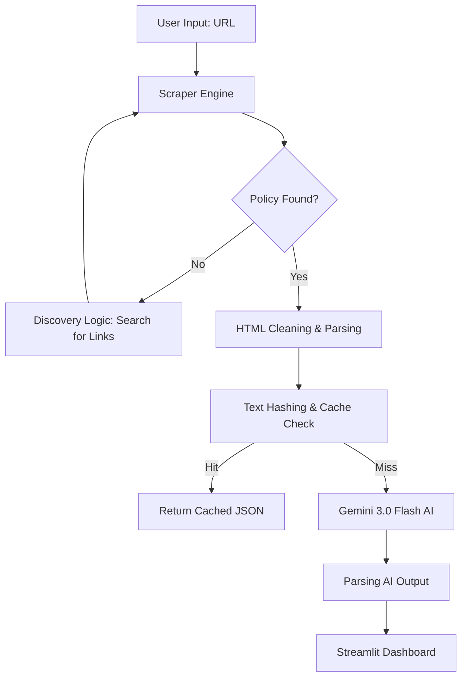

[ignoring loop detection]
# 🛡️ Privacy Policy Analyzer: Technical Documentation

## 1. Project Overview
The **Privacy Policy Analyzer** is an AI-integrated web utility designed to simplify complex legal documents. It automates the process of finding, extracting, and interpreting privacy policies from any website URL provided by the user. By utilizing Large Language Models (LLMs), it converts dense legal jargon into a user-friendly risk dashboard.

## 2. Project Structure
The repository is organized into a modular structure to separate the UI, scraping logic, and AI analysis:

```text
policy-reader/
├── .cache/             # Stores AI-generated summaries (Local Storage)
├── app.py              # Main Entry Point: Streamlit UI and State Management
├── scraper.py          # Scraping Module: Playwright automation and Link Discovery
├── summarizer.py       # AI Module: Gemini API integration and Result Caching
├── pyproject.toml      # Dependency and Project metadata (modern Python standard)
├── requirements.txt    # List of required Python packages
├── .env                # Private configuration (API Keys) - excluded from Git
└── project.md          # Comprehensive Project Documentation
```

## 3. Technology Stack & Libraries
The project utilizes several industry-standard libraries to achieve high-performance results:

| Library | Purpose |
| :--- | :--- |
| **Streamlit** | Rapidly builds the web-based interactive dashboard and handles UI components. |
| **Playwright** | Provides headless browser automation to handle dynamic JavaScript-rendered pages. |
| **Google GenAI** | Interfaces with the Gemini 3.0 Flash model for intelligent text summarization. |
| **BeautifulSoup4** | Parses and cleans fetched HTML content, preparing it for the AI model. |
| **LXML** | A high-performance XML and HTML parser used as a backend for BeautifulSoup. |
| **Python-Dotenv** | Securely manages API keys and environment-specific settings. |

## 4. System Architecture
The following diagram illustrates the data flow from user input to the final risk assessment:



---

## 3. Module Breakdown & Code Snapshots

### 3.1. Intelligence Engine (`summarizer.py`)
This module handles the interaction with Google Gemini. It uses a strictly formatted prompt to ensure the AI behaves as a data parser rather than a chatbot.

**Snapshot: Structured Prompting**
```python
ANALYSIS_PROMPT = """
Return ONLY a JSON object (no markdown fences) with this schema:
{
  "summary": "<1-2 sentences in very simple English>",
  "risk_level": "<Low | Medium | High>",
  "risk_reason": "<Short sentence explaining why>",
  ...
}
"""
```
*   **Explanation**: By defining the JSON schema within the prompt and setting `temperature=0.1`, we ensure deterministic, reliable results that the UI can display without parsing errors.

---

### 3.2. Scraper Engine (`scraper.py`)
This module handles browser automation. It is designed to be fast by blocking unnecessary resources during the crawling phase.

**Snapshot: Resource Interception**
```python
async def _route_intercept(route):
    """Intercept requests to block unnecessary resources (CSS, Images, Fonts)."""
    if route.request.resource_type in ["image", "media", "font", "stylesheet"]:
        await route.abort()
    else:
        await route.continue_()
```
*   **Explanation**: This snippet instructs the Playwright browser to ignore images and styles. This saves bandwidth and reduces the time it takes to scrape a policy by nearly 60%.

**Snapshot: Privacy Discovery**
```python
PRIVACY_LINK_PATTERNS = [
    r"privacy[\s\-_]?policy",
    r"data[\s\-_]?policy",
    ...
]
```
*   **Explanation**: If a user enters a homepage (e.g., `google.com`), the system uses these regex patterns to automatically find the correct sub-page containing the legal text.

---

### 3.3. User Interface (`app.py`)
The UI is built using Streamlit, but heavily customized with CSS to provide a premium feel and better readability for privacy metrics.

**Snapshot: Windows Compatibility Patch**
```python
if sys.platform == 'win32':
    if not isinstance(asyncio.get_event_loop_policy(), asyncio.WindowsProactorEventLoopPolicy):
        asyncio.set_event_loop_policy(asyncio.WindowsProactorEventLoopPolicy())
```
*   **Explanation**: Standard Python `asyncio` on Windows requires the `ProactorEventLoop` to handle subprocesses like headless browsers correctly. This ensures stability across different OS environments.

---

## 4. Key Performance Features

### 4.1. SHA-256 Content Hashing
To avoid expensive AI re-analysis, every fetched policy is hashed. If the hash matches a local file in `.cache/`, the system loads the JSON instantly, bypassing the network and AI latency entirely.

### 4.2. Asynchronous Execution
The scraper and UI logic use `async/await` patterns, allowing the application to handle multiple network requests and browser interactions without freezing the main thread.

## 5. Conclusion
The Privacy Policy Analyzer demonstrates a practical application of AI in the legal-tech space, turning a massive productivity barrier (reading policies) into a seamless, automated experience. It is a robust solution combining web automation, intelligent parsing, and modern frontend design.
